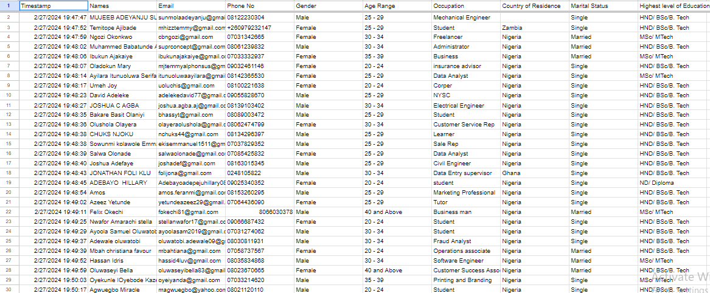
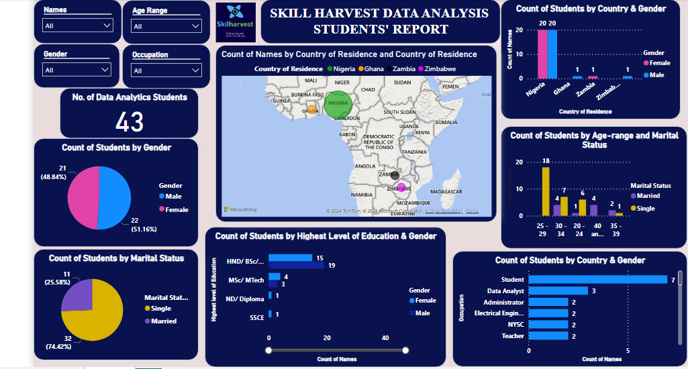

# SKILLHARVEST DATA ANALYSIS ACADEMY STUDENT DATA-SURVEY
This is a data of Data-Analysis students of Skillharvest academy; Cohort 2 of 2024; who filled the data form with some metrics to analyze the class.

## DOCUMENTATION OUTLINE

- [Project Overview](#project-overview)

- [Data Sources](#data-sources)

- [Tools Used for Analysis](#tools-used-for-analysis)

- [Data Cleaning, Preparation and Transformation](#data-cleaning-preparation-and-transformation)

- [Observations and Results](#observations-and-results)

- [Recommendations](#recommendations)

- [Contact Info](#contact-info)

## Project Overview
This project is to tell a story about the academy population demography based on metrics sych as Country of residence, marital status,gender, education, profession, etc.

## Data Sources
The Raw data was provided by all interns in the academy; filling a google survey form.   Raw Data consisted of 45 rows and 10 columns; totals 450 data entries of the data analysis interns of the training academy.

## Tools Used for Analysis
- Ms Excel for Data Cleaning [Download Here](https://www.microsoft.com/en-us/microsoft-365/excel)
- MS Power BI for Report & Visualization [Download Here](https://powerbi.microsoft.com/en-us/downloads/)
- MS Powerpoint for presentation [Download Here](https://www.microsoft.com/en/microsoft-365/powerpoint)
  
## Data Cleaning, Preparation and Transformation
- The data was cleaned by removing duplicates from students who filled the form twice and blanks removed.
- The data was cleaned by replacing values that were same as in corper and NYSC in occupation.

## Observations and Results

### Insights from the SkilHarvest Interns Demographics:
- Number of students who filled the form were 43.
- There are 22 male students and 21 female students that is 51.16% and 48.84% respectively.
- There are 32 single students and 11 married students which accounts for 74.42% and 25.58% respectively.
- The Age-group with highest number of students is 25-29 students which accounts for 18 students at 41.86% of the class size. of which all of the students within this age group are single...
- Nigeria had the most number of students, which is 40 students(20males, 20females) at over 93% of the class size.
- The student had over 31 different occupations of which 'student' had the most number , followed by data analyst. We had occupational disparity of over 72%;
- Most of the class had at least Bachelor's Degree level except for 1 student whom was havimg SSCE(Senior school) level.

- - In Summary; we have a stable class disparity between both genders;
  - We also have a lot of single students taking up the challenge to learn data analysis. This is a very key trend that shouldn't be ignored
and most of them are within the age-group of 20-34.

## Recommendations
- Here are some recommendations from the analysis:
- Given that we saw a readiness and wiliness to learn the skill of data analysis from interns between 20-34, i will recommend that the academy channel their marketing target audience within this age range to get a more productive result. and reduce the ad rate.
- Given that most interns within the class came majorly from one Country(Nigeria), if the goal of the academy is to grow their reach and impact across the continent, we will also advice them targeting other African countries to have diversity and inclusion ; however if the goal is to penetrate Nigeria first and foremost, they could focus their resources and get the most out of their Nigerian audience.
- Given that we had a lot of interns from so many different professions(31 different occupation), it tells about how very appealing  the course is to wide audience; This could be used to full advantage in recruiting future interns.
- In Summary; the academy had the most interns from 20-34 years who were simgle and whose education level is at least BSC level who were from Nigeria.

## Contact Info
Feel free to reach out to me via email at adelekedavid77@gmail.com or to connect with me on [LinkedIn](http://www.linkedin.com/in/adeleke-davido) for any inquiries & collaboration 

Let's dive into the world of data together and uncover valuable insights!

